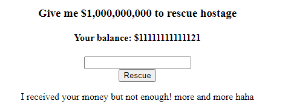
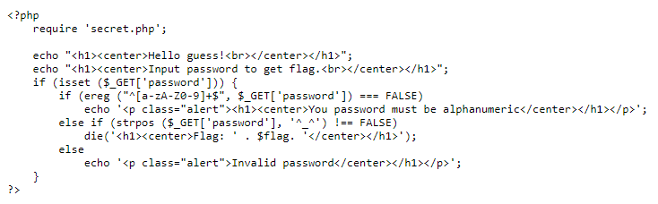
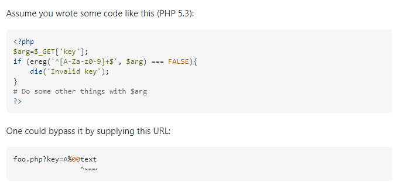

## [We're out of idea, let's call it Web2](https://ctf.viblo.asia/puzzles/we-re-out-of-idea-let-s-call-it-web2-hlygivzyghj "We're out of idea, let's call it Web2")

Trang web cho mình 1 ô input để nhập số tiền chuộc giải cíu con tin. Đòi tận 1 tỉ mà mình chỉ có mỗi 10$.

Mình thử chuộc bằng 1$ thì nó vẫn lấy tiền của mình và bảo là khum đủ xèng. Lúc này mình còn có 1$ :((( Nếu nhập số tiền lớn hơn thì sẽ bị báo là khum đủ xèng. Hồi trước từng gặp 1 câu như này nên mình thử nhập 1 số âm `-11111111111111` và lúc này thì số tiền của mình trở thành 

>

Số tiền mình bây giờ đã đủ nên là chuộc con tin thôy

## [Web7](https://ctf.viblo.asia/puzzles/web7-qwevvyc7qkq "Web7")

>[http://172.104.49.143:1312](http://172.104.49.143:1312/)

Check source code và thử index.php và index.phps mà vẫn không có gì nên mình thử đá qua robots.txt và tìm được 1 path `/index.abc`. 

>

Mình sẽ có 1 cái password và hàm ereg giới hạn ký tự bắt buộc chỉ có thể là các số hoặc chữ in hoa, thường. Vậy mà ở phần check lại yêu cầu password = `^_^` là điều khum thể. Search google về hàm ereg thì thấy có cách để bypass nên thử luôn 

>

Thử `http://172.104.49.143:1312/?password=A%00^_^ ` và có được flag