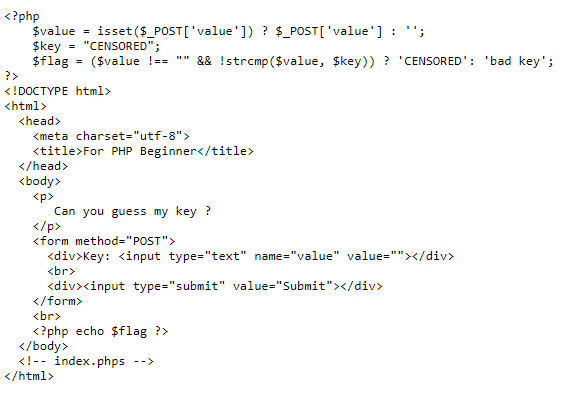
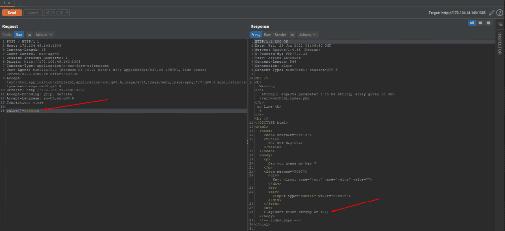

## [Mã Morse Kì Lạ](https://ctf.viblo.asia/puzzles/ma-morse-ki-la-qifai8jf7dk "Mã Morse Kì Lạ")

> Mã Morse không còn quá xa lạ với chúng ta nhưng nay nó đã có chút cải tiến mới. Liệu rằng các bạn có nhận ra sụ cải tiến này, hãy giúp mình tìm ra thông điệp trong đoạn mã này nhé.
> 
> `YYXY YXYY YX XXY { X YYYY Y _ XX XXX YXY YYY Y _ XYXX XXX YYX _ XYX XY XXX YXX _ X YYYY Y _ XX XXX YXY Y _ XYXX XXX YYX _ XYX XY XXX YXX }`

Bài này thì tên bài cũng đã gợi ý quá rõ rồi :v chỉ là thay các chữ cái X Y thành các ký tự `.`, `-`. Ở đây thì mình thay chữ Y thành `.` và chữ X thành `-` thì được `FLAG{THETMORSETYOUTKNOWTTHETMORETYOUTKNOW}`

## [Đen - Lối Nhỏ ft. Phương Anh Đào](https://ctf.viblo.asia/puzzles/den-loi-nho-ft-phuong-anh-dao-bgvo65idf2c "Đen - Lối Nhỏ ft. Phương Anh Đào")

Giải nén file zip và mở ảnh bằng phần mềm HxD để kiếm flag

## [Catchphrase](https://ctf.viblo.asia/puzzles/catchphrase-yphxlovitjc "Catchphrase")

Google search hình ảnh sẽ ra được tên phim :v 

## [XOR easy](https://ctf.viblo.asia/puzzles/xor-easy-jisqsheiied "XOR easy")

> Do you decode me?
>
> cipher:  `321815130f0c44062b1d072b07441911001c451a4d09`

Dùng [dcode.fr](https://www.dcode.fr/xor-cipher) và chọn knowing the key size (in bytes) = 1. Vì bài có hint key là 1 ký tự. Và ctrlF tìm Flag trong result :v 

## [Tragic pHp](https://ctf.viblo.asia/puzzles/tragic-php-jjq3i6qrgkd "Tragic pHp")

> They said that PhP is tragic language too [http://172.104.49.143:1303/](http://172.104.49.143:1303/)

Check source code thì thấy comment phần index.phps nên thử check index.phps coi được gì khum. 

>

Ở đây thì mình sẽ sử dụng strcmp để so sánh cái value mình nhập vào với key. Nếu điều kiện của if đúng thì sẽ trả về flag còn sai thì hiển thị 'bad key'. Điều kiện so sánh của nó là nếu value khác rỗng và strcmp(value, key) trả về 0 thì sẽ có cờ. 

Lưu ý strcmp có 1 cái thú vị đó là khi so sánh chuỗi với chuỗi thì không sao nhưng khi so sánh mảng thì lại cho kết quả NULL == 0

>

## [Do you know Brute Force](https://ctf.viblo.asia/puzzles/do-you-know-brute-force-oqc00sko7vw "Do you know Brute Force")

> [http://172.104.49.143:1556/](http://172.104.49.143:1556/)

Check source code thì thấy có 2 file user và pass. Dùng Burp để brute và ra được flag :v

